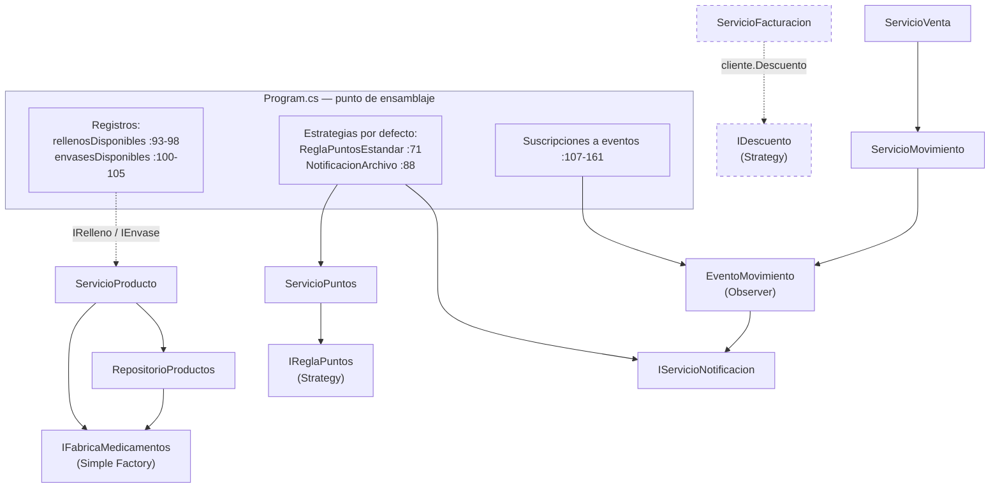

# RETO 2 — ACTIVIDAD 6

## Vista para el equipo de desarrollo

**Para quién es este documento:** para quien entra al equipo dentro de seis meses y tiene que hacer un cambio sin romper nada. No estuvo en ninguna reunión y no tiene por qué leerse el sistema entero antes de tocar una línea.

**Cómo usarlo:** si vienes a hacer un cambio concreto, ve directo a la **sección 4, la guía de dónde tocar**. Las secciones 1 a 3 son el mapa; la 5 son las reglas que no se rompen; la 6 es lo que sabemos que quedó mal y por qué.

Todas las rutas son relativas a `03-src/SolucionFarmacia/`. Las líneas corresponden al estado del código en esta entrega.

---

## 1. El sistema en treinta segundos

Dos proyectos en `SolucionFarmacia.sln`, ambos `net8.0`:

- **`BibFarmacia`** — biblioteca. Todo el dominio, los contratos, los adaptadores de archivo y los servicios.
- **`AppFarmaciaConsola`** — consola. Un único `Program.cs` con instrucciones de nivel superior: es el **punto de ensamblaje** y el menú.

Hay una tercera carpeta, `BibliotecaAnterior/BibFarmacia/`, que es la copia congelada de la biblioteca antes de los patrones. **No está en la solución y no debe agregarse**: declara el mismo nombre de ensamblado y los mismos espacios de nombres, así que colisiona. Existe solo como referencia del antes.

Los datos son cuatro archivos de texto en `AppFarmaciaConsola/`, separados por punto y coma, que se copian a la salida al compilar. **La carga es de solo lectura: el sistema no escribe nunca de vuelta.** Ventas, existencias y puntos viven en memoria y se pierden al cerrar.

No hay pruebas automatizadas ni analizador estático. La verificación es por ejecución y comparación de salidas.

---

## 2. Qué patrón hay, dónde vive y qué papel cumple cada clase

| Patrón | Punto de dolor | Contrato | Implementaciones | Quién lo consume |
|---|---|---|---|---|
| **Simple Factory** | P-01 · construir cada presentación de medicamento | `Interfaces/IFabricaMedicamentos.cs` (dos sobrecargas de `Crear`, una por presentación) | `Factories/FabricaMedicamentos.cs` | `Servicios/ServicioProducto.cs` (alta interactiva) y `Repositorios/RepositorioProductos.cs` (carga desde archivo) |
| **Strategy — puntos** | P-02 · cuántos puntos genera una compra | `Interfaces/IReglaPuntos.cs` (`Calcular(int)`) | `Clases/ReglaPuntosEstandar.cs`, `Clases/ReglaPuntosDoble.cs` | `Servicios/ServicioPuntos.cs:19-25`, inyectada por constructor |
| **Strategy — descuento** | P-03 · de quién depende un descuento | `Interfaces/IDescuento.cs` (`CalcularDescuento(decimal)`) | `Clases/SinDescuento.cs`, `Clases/DescuentoPorcentual.cs` | `Clases/Cliente.cs:23` la porta; `Servicios/ServicioFacturacion.cs:22-32` la invoca. **Hoy esa sobrecarga no tiene ninguna llamada** (ver deuda D-03) |
| **Observer** | P-08 · quién reacciona a lo que pasa en el dominio | `Eventos/EventoStockMinimo.cs`, `EventoVencimiento.cs`, `EventoPuntos.cs`, `EventoMovimiento.cs` — cada uno con delegado, `event` y `Disparar()` | Suscriptores: lambdas de consola y `Servicios/NotificacionArchivo.cs` (`IServicioNotificacion`) | Sujetos: `ServicioInventario`, `ServicioPuntos`, `ServicioMovimiento`. Suscripciones: `Program.cs:107-161` |

**Estrategias que ya venían del Reto 1** y siguen vigentes: `IRelleno` (`RellenoGel`, `RellenoPolvo`) e `IEnvase` (`EnvaseVidrio`, `EnvasePlastico`), seleccionadas por los registros de `Program.cs:93-105`.

### Cómo se relacionan entre sí

Tres puntos de contacto que conviene tener claros antes de tocar algo:

1. **La fábrica tiene dos consumidores, no uno.** `RepositorioProductos` la usa para la carga desde archivo y `ServicioProducto` para el alta interactiva. Un cambio en `IFabricaMedicamentos` impacta a los dos.
2. **La estrategia de puntos y el evento de puntos se disparan en el mismo método.** `ServicioPuntos.AcumularPuntos` calcula con la regla, delega la suma en `Cliente` y dispara el evento, en ese orden. Si la regla lanza, el evento no se dispara.
3. **La venta llega al Observer por rebote.** `ServicioVenta.RegistrarVenta` no conoce ningún evento: llama a `IRegistroMovimientos.RegistrarMovimiento`, y es `ServicioMovimiento` quien dispara. Por eso una excepción de un suscriptor sube hasta la venta (ver regla 4 y deuda D-06).

---

## 3. Dónde se ensambla el sistema

Todo en **`AppFarmaciaConsola/Program.cs`**. No hay contenedor de inyección: el cableado es manual y explícito, y esa es una decisión, no una carencia.

| Líneas | Qué hay ahí |
|---|---|
| `10-27` | `ResolverRutaDatos`: busca cada archivo primero junto al binario y después en el directorio actual |
| `29-33` | Rutas de los cuatro archivos de datos y del archivo de avisos |
| `35-105` | **Composition root.** Construcción de los doce servicios, elección de las estrategias por defecto y registros de rellenos/envases |
| `38-41` | `ServicioProducto` con su repositorio y su fábrica |
| `69-71` | Regla de puntos vigente — **la línea que se cambia para demostrar Strategy** |
| `87-88` | Canal de aviso, declarado como `IServicioNotificacion` |
| `93-105` | Registros de `IRelleno` e `IEnvase` |
| `107-161` | Suscripciones a los cuatro eventos. La de `:158-161` es el segundo observador del evento de movimiento |
| `163-190` | Carga de los archivos. Ojo: la de servicios es **silenciosa** a propósito (regla 5) |
| `192-234` | Login |
| `236-242` | Alertas de existencias y vencimiento al arrancar |
| `244-718` | Menú: `while (opcion != 11)` con once casos. Cada opción arranca en `:278, 303, 329, 349, 380, 397, 531, 554, 591, 658, 696` |

**Regla de oro:** ningún `new` de una implementación concreta debe existir fuera de este archivo. Hoy hay tres excepciones y son deuda declarada, no ejemplo a seguir (D-01).

---

## 4. La guía de dónde tocar

El artefacto central de esta vista. Para cada cambio previsible: qué crear, qué modificar, qué **no** tocar, y cómo verificar que no rompiste nada. Las tres solicitudes del Anexo B están en las filas C-02, C-03 y C-04.

| ID | Cambio | Qué crear | Qué modificar | Qué NO tocar | Cómo verificar |
|---|---|---|---|---|---|
| **C-01** | **Nueva presentación de medicamento** (p. ej. crema, con su propia característica) | `Clases/MedicamentoCrema.cs : Medicamento`; si la presentación trae una variante propia, su interfaz de estrategia y sus implementaciones | `Interfaces/IFabricaMedicamentos.cs` y `Factories/FabricaMedicamentos.cs` (sobrecarga nueva de `Crear`) · `Repositorios/RepositorioProductos.cs:58-79` (caso nuevo en el `switch`) · `Servicios/ServicioProducto.cs` (sobrecarga nueva de `AgregarProducto`) · `Program.cs:397-530` (caso 6 del menú) · registro nuevo en `Program.cs:93-105` si trae variante | `Clases/Producto.cs`, `Clases/Medicamento.cs`, `Interfaces/IFacturable.cs`, `Interfaces/IInventariable.cs` · el **formato** de `productos.txt` (agregar un valor nuevo en la primera columna sí se puede; agregar una columna no) | Los diez productos actuales siguen cargando con el mismo nombre, precio y existencia. Este es el punto de extensión más caro que queda: está declarado en D-02 |
| **C-02** | **Vender cosméticos y comestibles** (solicitud de categorías nuevas) | Un conjunto propio y completo por categoría: `Clases/Cosmetico.cs : Producto`, `Interfaces/IFabricaCosmeticos.cs`, `Factories/FabricaCosmeticos.cs`, `Repositorios/RepositorioCosmeticos.cs`, `Servicios/ServicioCosmeticos.cs` y su archivo de datos propio | `Program.cs`: construir el conjunto nuevo en el composition root, sumarlo a los candidatos de venta del caso 9 (`:591-657`) y al listado del caso 1 (`:278-302`) si debe verse | `Factories/FabricaMedicamentos.cs`, `Interfaces/IFabricaMedicamentos.cs`, `Repositorios/RepositorioProductos.cs`, toda la jerarquía `Medicamento*` y `productos.txt`. **Una categoría nueva no pasa por la fábrica de medicamentos**: ese es el argumento de alcance con el que se aceptó el `switch` de C-01 | Los medicamentos siguen cargando y vendiéndose igual. **Antes de empezar esta fila, cerrar D-01**: si no, cada categoría copia el mismo error |
| **C-03** | **Vender un servicio nuevo** (solicitud de servicios; el modelo ya existe desde el Reto 1) | Nada de código | Una línea en `AppFarmaciaConsola/servicios.txt` (`Nombre;Precio;DuracionMinutos`) | Todo el código. `Clases/Servicio.cs` **no** hereda de `Producto` a propósito: un servicio se factura pero no tiene existencias ni vencimiento | Aparece en el menú 2 y es vendible desde el menú 9 eligiendo "2. Servicio" |
| **C-04** | **Nuevo convenio de descuento** (solicitud de convenios) | Solo si la condición no es un porcentaje simple: una implementación nueva de `Interfaces/IDescuento.cs` | **Primero D-03**: `Servicios/ServicioVenta.cs:31-53` debe recibir `ServicioFacturacion` y el `Cliente`, calcular y conservar subtotal/descuento/total; y `Program.cs:375` debe leer ese total guardado en vez de recalcularlo. **Después**: asignar la estrategia a cada cliente en el composition root, tras `servicioCliente.Cargar` | `Clases/Cliente.cs` salvo la asignación · `Interfaces/IDescuento.cs` · `Repositorios/RepositorioClientes.cs` · el formato de `clientes.txt` (no tiene columna de convenio y no se le agrega: la asignación se resuelve en el ensamblaje, por cédula) | El total que imprime la venta y el que muestra "Ver movimientos" deben coincidir. Con `SinDescuento`, dos Dolex siguen dando 10000; con `DescuentoPorcentual(0.10m)`, 9000. **Validar el porcentaje antes de crear el primer convenio real (D-04)** |
| **C-05** | **Nueva regla de acumulación de puntos** (promoción) | Una implementación de `Interfaces/IReglaPuntos.cs` en `Clases/` | Una línea: `Program.cs:71` | `Clases/Cliente.cs`, `Servicios/ServicioPuntos.cs`, el menú. Si tuviste que tocar alguno de los tres, el patrón se aplicó mal | Con la regla estándar, 50 tecleados siguen dando 50. **Lo que se entrega va con `ReglaPuntosEstandar`** (regla 6) |
| **C-06** | **Nuevo canal de aviso** (correo, otro archivo, otro destino) | Una implementación de `Interfaces/IServicioNotificacion.cs` en `Servicios/` | Una suscripción más en `Program.cs:107-161`, con su cuerpo envuelto en `try/catch` propio | `Eventos/*` — el evento no debe conocer a ningún canal · `Servicios/ServicioMovimiento.cs` · cualquier servicio de dominio | La consola sigue imprimiendo exactamente lo mismo y el canal nuevo recibe el mismo mensaje. Si el canal nuevo escribe en consola, rompes la comparación de salidas |
| **C-07** | **Nuevo relleno o envase** | Una implementación de `Interfaces/IRelleno.cs` o `Interfaces/IEnvase.cs` en `Clases/` | Una línea en el registro correspondiente de `Program.cs:93-105` | Servicios, fábrica y menú: el menú lee las claves del diccionario, así que la opción aparece sola | Aparece en el texto de la opción del menú 6 sin haber tocado el menú |
| **C-08** | **Cambiar el formato de un archivo de datos** | — | **No se hace.** Los cuatro archivos están congelados (regla 2) | Los cuatro `.txt` y sus repositorios | Si necesitas un dato que el archivo no tiene, resuélvelo en el composition root (como el convenio por cédula de C-04) o en un archivo nuevo aparte con su propio repositorio |
| **C-09** | **Persistir los cambios** (guardar ventas, existencias o puntos en disco) | Implementación de guardado por cada repositorio | `Interfaces/IRepositorio.cs` (hoy solo declara `Cargar`) y los cuatro repositorios | — | **Cambia el comportamiento observable**: hoy los datos se pierden al cerrar y esa es la salida contra la que se compara. Requiere una solicitud autorizada antes de escribir una línea |

---

## 5. Reglas que no se deben romper

Cada una con el porqué. No son estilo: son las condiciones bajo las que se aceptó este diseño.

1. **El comportamiento observable está congelado.** Mismas pantallas, mismos textos, mismos números. *Por qué:* es la condición del encargo y lo que hace auditable la comparación de salidas. *Cómo se verifica:* corriendo los casos del Reto 1 y comparando línea por línea contra el binario anterior.
2. **Los cuatro archivos de datos no cambian de formato, y nadie escribe en ellos.** *Por qué:* todo el diseño se midió y se justificó bajo esa restricción; un cambio de formato invalida las mediciones de la Actividad 1 y las evidencias de la Actividad 4.
3. **Todo concreto se construye en `Program.cs`.** *Por qué:* es lo único que hace que agregar una variante sea una línea y no una cacería. *Excepción declarada, no permiso:* hoy `RepositorioProductos` la incumple (D-01).
4. **Ningún suscriptor puede lanzar hacia quien dispara el evento.** El cuerpo de cada suscripción lleva su propio `try/catch`. *Por qué:* `EventoMovimiento.Disparar` se ejecuta dentro de `RegistrarMovimiento`, que se ejecuta dentro de `RegistrarVenta`; una excepción de un canal de avisos tumba la venta con el stock ya descontado (D-06).
5. **La carga de `servicios.txt` es silenciosa.** Su cadena de resultado se descarta a propósito en `Program.cs`. *Por qué:* mantiene la salida de arranque idéntica a la del sistema original. No la conviertas en un `Console.WriteLine` "para que se vea".
6. **Lo que se entrega va con las estrategias por defecto:** `ReglaPuntosEstandar` y `SinDescuento`. *Por qué:* cualquier otra combinación cambia el comportamiento observable sin solicitud que la respalde. Las alternativas se demuestran en vivo, no se entregan cableadas.
7. **No se agregan dependencias externas, proyectos nuevos ni capas nuevas.** *Por qué:* el encargo limita el trabajo a cómo colaboran los objetos del back que ya existe. Si tu solución necesita un contenedor de inyección o una capa de aplicación, es la solución equivocada para este encargo.
8. **`BibliotecaAnterior/` no se toca ni se agrega a la solución.** *Por qué:* mismo nombre de ensamblado y mismos espacios de nombres que `BibFarmacia`; agregarla rompe la compilación. Es la referencia del antes.
9. **No se capturan excepciones en el menú "para arreglar" los caminos que abortan.** *Por qué:* cambiaría el comportamiento observable. Está declarado como deuda (D-05), no como descuido.

---

## 6. Deuda declarada

Lo que sabemos que quedó mal o incompleto. Está aquí para que no lo descubras solo y para que no lo copies.

| ID | Qué | Dónde | Por qué quedó así | Qué la cierra |
|---|---|---|---|---|
| **D-01** | La regla 3 está rota: el repositorio construye sus propios concretos | `Repositorios/RepositorioProductos.cs:17-20` (constructor sin parámetros que hace `new FabricaMedicamentos()`), `:67` y `:75` (`new RellenoGel()`, `new EnvaseVidrio()`); `Program.cs:40-41` crea una **segunda** instancia de la misma fábrica | Descuido de conveniencia, no decisión de diseño. Es la única celda en **Roto** de la matriz de la Actividad 4, declarada sin compensación | Quitar el constructor sin parámetros, pasar desde `Program.cs` la instancia que ya crea, y resolver relleno/envase por defecto desde los registros de `Program.cs:93-105`. **Hacerlo antes de C-02** |
| **D-02** | El `switch` de presentaciones sigue vivo | `Repositorios/RepositorioProductos.cs:58-79` | Costo aceptado con argumento de alcance: el eje de extensión real (categorías nuevas) no pasa por aquí. La versión con Factory Method se implementó, se verificó y se retiró a propósito | Nada, mientras no aparezca una tercera presentación de medicamento. Si aparece, reabre este archivo (C-01) |
| **D-03** | La venta no calcula ni conserva el importe | `Servicios/ServicioVenta.cs:31-53` no toca `ServicioFacturacion` · `Program.cs:375` recalcula el total a precio actual · `Servicios/ServicioFacturacion.cs:22-32` no tiene ninguna llamada · `Clases/Cliente.cs:30` es la única asignación de `Descuento`, siempre `SinDescuento` | Es el punto de dolor P-04, todavía abierto. Strategy de descuento está construido y verificado, pero sin consumidor real en el flujo | La Fase 5 del plan de implementación. **Bloquea C-04**: es el riesgo de mayor exposición del registro de riesgos |
| **D-04** | `DescuentoPorcentual` no valida su porcentaje | `Clases/DescuentoPorcentual.cs:15-18`; `Interfaces/IDescuento.cs:11` no declara ningún límite sobre el resultado | Salvedad ya declarada en la fila LSP de la matriz de la Actividad 4 | Validar el intervalo `[0,1]` en el constructor y declarar en el contrato que el descuento nunca supera el precio |
| **D-05** | Caminos que abortan la aplicación | Vender más que la existencia (`Clases/Producto.cs:77-82` vía `Program.cs:644`), acumular 0 puntos (`Clases/Cliente.cs:33-38` vía `Program.cs:684`), alta de producto con precio 0. `Program.cs` no tiene un solo `try` | Heredado del sistema original y preservado a propósito: capturarlo cambiaría el comportamiento congelado. Asimetría conocida: el alta de **servicios** sí captura (`ServicioObjetoServicio.cs:29-42`) y la de **productos** no, porque la fábrica se invoca fuera del `try` | Una solicitud autorizada que cambie el comportamiento. Mientras tanto, se declara y no se toca |
| **D-06** | Un suscriptor que lanza tumba la venta | `Servicios/NotificacionArchivo.cs:18-23` (`File.AppendAllText` sin manejo de error) → `ServicioMovimiento.cs:26-33` → `ServicioVenta.cs:31-53` | El canal se conectó para demostrar Observer con un segundo destino real y no se blindó | `try/catch` en el cuerpo de la suscripción de `Program.cs:158-161`, y la regla 4 aplicada a todo canal futuro |
| **D-07** | Clases sin uso | `Clases/ProductoRequest.cs` (huérfana desde que la fábrica pasó a parámetros explícitos) · `Servicios/ServicioNotificacion.cs` (canal de consola, alternativa no cableada) · `IRelleno.InstruccionesConservacion()` e `IEnvase.EsRetornable()`, nunca llamados | `ProductoRequest` es residuo y puede borrarse. `ServicioNotificacion` se conserva a propósito: es la implementación alternativa que demuestra que cambiar de canal es una línea | Borrar `ProductoRequest`. Los otros, dejarlos como están |
| **D-08** | El menú es un `switch` de once casos: 439 de las 718 líneas del archivo | `Program.cs:276-714` (el `switch`); el bucle completo, `:248-715` | **No se interviene**, y está argumentado: son ramas de captura de entrada, no de negocio; sustituirlas exigiría once clases nuevas para un menú que no crece con ninguna de las tres solicitudes. Es el punto de dolor P-07 | Nada. Es una decisión, no un pendiente |
| **D-09** | No hay pruebas automatizadas | Todo el repositorio | El sistema es interactivo y la evidencia exigida es comparación de salidas | Si agregas pruebas, que no cambien el comportamiento del binario que se compara |

---

## 7. Prueba de que esta vista sirve

Se le entrega este documento a alguien que no participó en el diseño y se le pide ubicar **dónde tocar**, sin ayuda y sin abrir el código antes de responder:

| Encargo | Debería llegar a | ¿Lo logró? |
|---|---|---|
| "Agrega un convenio del 15 % para una universidad" | C-04, y darse cuenta de que D-03 lo bloquea | |
| "Que los avisos también se manden por correo" | C-06 y la regla 4 | |
| "Vamos a vender gaseosas y snacks" | C-02, y saber que no debe tocar la fábrica de medicamentos | |
| "Duplica los puntos el sábado" | C-05, y saber que solo cambia una línea | |
| "Agrega una columna al archivo de clientes" | C-08, y saber que la respuesta es no | |

Si alguien tiene que abrir el código para responder cualquiera de las cinco, a este documento le falta algo y hay que arreglarlo.
