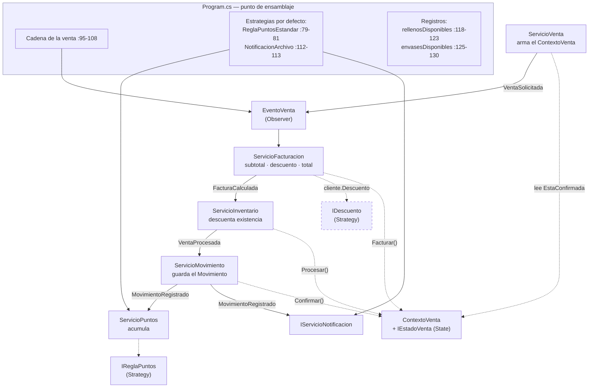

# RETO 2 — ACTIVIDAD 6

## Vista para el equipo de desarrollo

**Para quién es este documento:** para quien entra al equipo dentro de seis meses y tiene que hacer un cambio sin romper nada. No estuvo en ninguna reunión y no tiene por qué leerse el sistema entero antes de tocar una línea.

**Cómo usarlo:** si vienes a hacer un cambio concreto, ve directo a la **sección 4, la guía de dónde tocar**. Las secciones 1 a 3 son el mapa; la 5 son las reglas que no se rompen; la 6 es lo que sabemos que quedó mal y por qué.

Todas las rutas son relativas a `03-src/SolucionFarmacia/`. Las líneas corresponden al estado del código en esta entrega (`Program.cs`, 776 líneas).

---

## 1. El sistema en treinta segundos

Dos proyectos en `SolucionFarmacia.sln`, ambos `net8.0`:

- **`BibFarmacia`** — biblioteca. Todo el dominio, los contratos, los adaptadores de archivo y los servicios.
- **`AppFarmaciaConsola`** — consola. Un único `Program.cs` con instrucciones de nivel superior: es el **punto de ensamblaje** y el menú.

Hay una tercera carpeta, `BibliotecaAnterior/BibFarmacia/`, que es la copia congelada de la biblioteca antes de los patrones. **No está en la solución y no debe agregarse**: declara el mismo nombre de ensamblado y los mismos espacios de nombres, así que colisiona. Existe solo como referencia del antes.

Los datos son cuatro archivos de texto en `AppFarmaciaConsola/`, separados por punto y coma, que se copian a la salida al compilar. **La carga es de solo lectura: el sistema no escribe nunca de vuelta.** Ventas, existencias y puntos viven en memoria y se pierden al cerrar.

No hay pruebas automatizadas ni analizador estático. La verificación es por ejecución y comparación de salidas, con **una excepción declarada y autorizada**: la pantalla de venta cambió a propósito para cerrar P-04 (ver regla 1).

---

## 2. Qué patrón hay, dónde vive y qué papel cumple cada clase

| Patrón | Punto de dolor | Contrato | Implementaciones | Quién lo consume |
|---|---|---|---|---|
| **Simple Factory** | P-01 · construir cada presentación de medicamento | `Interfaces/IFabricaMedicamentos.cs` — tres `Crear`: una que recibe el registro leído del archivo y dos explícitas, una por presentación | `Factories/FabricaMedicamentos.cs` | `Servicios/ServicioProducto.cs:52` y `:73` (alta interactiva) y `:98` (carga desde archivo). **Es el único consumidor: el repositorio ya no la conoce** |
| **Strategy — puntos** | P-02 · cuántos puntos genera una compra | `Interfaces/IReglaPuntos.cs` (`Calcular(int)`) | `Clases/ReglaPuntosEstandar.cs`, `Clases/ReglaPuntosDoble.cs` | `Servicios/ServicioPuntos.cs:19-25`, inyectada por constructor desde `Program.cs:79-81` |
| **Strategy — descuento** | P-03 · de quién depende un descuento | `Interfaces/IDescuento.cs` (`CalcularDescuento(decimal)`) | `Clases/SinDescuento.cs`, `Clases/DescuentoPorcentual.cs` | `Clases/Cliente.cs:23` la porta; **`Servicios/ServicioFacturacion.cs:31-33` la invoca en toda venta**. Lo que falta es asignarla a alguien (D-03b) |
| **Observer** | P-08 · quién reacciona a lo que pasa en el dominio | `Eventos/EventoVenta.cs` — cuatro eventos encadenados; más `EventoStockMinimo`, `EventoVencimiento`, `EventoPuntos` para los avisos | Suscriptores: los cuatro servicios de la cadena, lambdas de consola y `Servicios/NotificacionArchivo.cs` (`IServicioNotificacion`) | Cadena de la venta: `Program.cs:95-108`. Avisos a consola y archivo: `Program.cs:134-195` |
| **State** | P-04 · en qué punto del cobro va una venta y qué se le puede pedir | `Interfaces/IEstadoVenta.cs` (`Facturar`/`Procesar`/`Confirmar`/`Fallar`) | `Clases/EstadosVenta/`: `Pendiente`, `Facturada`, `Procesada`, `Confirmada`, `Fallida`, sobre `EstadoVentaBase` | `Clases/ContextoVenta.cs` — delega cada transición en su estado actual |

**Estrategias que ya venían del Reto 1** y siguen vigentes: `IRelleno` (`RellenoGel`, `RellenoPolvo`) e `IEnvase` (`EnvaseVidrio`, `EnvasePlastico`), seleccionadas por los registros de `Program.cs:118-130`.

### Cómo se relacionan entre sí

El corazón del sistema es **la cadena de la venta**. Ningún servicio llama a otro: cada uno se suscribe a un evento, hace su parte, mueve el estado del `ContextoVenta` y dispara el siguiente.

`IDescuento` sigue punteado: está invocado en cada venta, pero **hoy siempre devuelve cero** porque nadie asigna una estrategia distinta a la de por defecto (D-03b).

Cuatro puntos de contacto que conviene tener claros antes de tocar algo:

1. **La fábrica tiene un solo consumidor.** `ServicioProducto` la usa para las dos vías, el alta interactiva y la carga. `RepositorioProductos` ya no construye nada: devuelve `RegistroProducto`, un dato plano, y quien decide qué clase nace es la fábrica.
2. **El orden de la cadena es el contrato.** Se factura antes de descontar existencia, y se descuenta antes de registrar el movimiento. Si inviertes dos pasos, cambias qué queda hecho cuando algo falla a la mitad (D-11).
3. **El estado decide qué se puede pedir.** `EstadoVentaBase` lanza por defecto en las tres transiciones; cada estado concreto habilita solo la suya. Pedirle `Confirmar` a una venta recién creada no es un `if` olvidado: es una excepción con nombre.
4. **Un fallo no se propaga: se convierte en estado.** `ServicioFacturacion:49-52` y `ServicioInventario:39-42` capturan y llaman `contexto.Fallar(...)`. `ServicioVenta` no ve excepciones, ve `EstaConfirmada` en falso y devuelve el motivo.

---

## 3. Dónde se ensambla el sistema

Todo en **`AppFarmaciaConsola/Program.cs`**. No hay contenedor de inyección: el cableado es manual y explícito, y esa es una decisión, no una carencia.

| Líneas | Qué hay ahí |
|---|---|
| `11-28` | `ResolverRutaDatos`: busca cada archivo primero junto al binario y después en el directorio actual |
| `30-34` | Rutas de los cuatro archivos de datos y del archivo de avisos |
| `36-130` | **Composition root.** El bus de eventos, los doce servicios, las estrategias por defecto y los registros |
| `36-37` | `EventoVenta`: se crea primero porque casi todos los servicios lo reciben |
| `42-45` | La fábrica, con su relleno, su envase y sus mililitros por defecto para lo que viene del archivo |
| `79-81` | Regla de puntos vigente — **la línea que se cambia para demostrar Strategy** |
| `95-108` | **La cadena de la venta.** Cuatro suscripciones, en orden. Leerlas es leer el flujo completo |
| `112-113` | Canal de aviso, declarado como `IServicioNotificacion` |
| `118-130` | Registros de `IRelleno` e `IEnvase` |
| `134-195` | Avisos: existencias, vencimiento, puntos, y las dos suscripciones al movimiento registrado (consola en `:167-180`, archivo en `:182-195`) |
| `198-225` | Carga de los archivos. Ojo: la de servicios es **silenciosa** a propósito (regla 5). **Aquí va la asignación de convenios** (C-04) |
| `227-269` | Login |
| `271-277` | Alertas de existencias y vencimiento al arrancar |
| `283-772` | Menú: `while (opcion != 11)`; el `switch` ocupa `:311-771`. Cada opción arranca en `:313, 338, 364, 384, 415, 432, 566, 589, 626, 716, 754` |

**Regla de oro:** ningún `new` de una implementación concreta debe existir fuera de este archivo. **Desde esta entrega se cumple sin excepciones** (ver D-01, cerrada).

---

## 4. La guía de dónde tocar

El artefacto central de esta vista. Para cada cambio previsible: qué crear, qué modificar, qué **no** tocar, y cómo verificar que no rompiste nada. Las tres solicitudes del Anexo B están en las filas C-02, C-03 y C-04.

| ID | Cambio | Qué crear | Qué modificar | Qué NO tocar | Cómo verificar |
|---|---|---|---|---|---|
| **C-01** | **Nueva presentación de medicamento** (p. ej. crema, con su propia característica) | `Clases/MedicamentoCrema.cs : Medicamento`; si la presentación trae una variante propia, su interfaz de estrategia y sus implementaciones | `Interfaces/IFabricaMedicamentos.cs` y `Factories/FabricaMedicamentos.cs:30-51` (caso nuevo en el `switch` y sobrecarga nueva de `Crear`) · `Servicios/ServicioProducto.cs` (sobrecarga nueva de `AgregarProducto`) · `Program.cs:432-565` (caso 6 del menú) · registro nuevo en `Program.cs:118-130` si trae variante | `Repositorios/RepositorioProductos.cs` — **ya no decide tipos, solo lee líneas** · `Clases/Producto.cs`, `Clases/Medicamento.cs`, `Interfaces/IFacturable.cs`, `Interfaces/IInventariable.cs` · el **formato** de `productos.txt` (agregar un valor nuevo en la primera columna sí se puede; agregar una columna no) | Los diez productos actuales siguen cargando con el mismo nombre, precio y existencia. El costo bajó de cuatro archivos a dos: queda declarado en D-02 |
| **C-02** | **Vender cosméticos y comestibles** (solicitud de categorías nuevas) | Un conjunto propio y completo por categoría: `Clases/Cosmetico.cs : Producto`, `Interfaces/IFabricaCosmeticos.cs`, `Factories/FabricaCosmeticos.cs`, `Repositorios/RepositorioCosmeticos.cs`, `Servicios/ServicioCosmeticos.cs` y su archivo de datos propio | `Program.cs`: construir el conjunto nuevo en el composition root, sumarlo a los candidatos de venta del caso 9 (`:626-715`) y al listado del caso 1 (`:313-336`) si debe verse | `Factories/FabricaMedicamentos.cs`, `Interfaces/IFabricaMedicamentos.cs`, toda la jerarquía `Medicamento*` y `productos.txt`. **Una categoría nueva no pasa por la fábrica de medicamentos**: ese es el argumento de alcance con el que se aceptó el `switch` de C-01 | Los medicamentos siguen cargando y vendiéndose igual. La venta funciona sin tocarla: basta con que la clase nueva implemente `IFacturable` e `IInventariable`, porque la cadena habla con las interfaces, no con `Medicamento` |
| **C-03** | **Vender un servicio nuevo** (solicitud de servicios; el modelo ya existe desde el Reto 1) | Nada de código | Una línea en `AppFarmaciaConsola/servicios.txt` (`Nombre;Precio;DuracionMinutos`) | Todo el código. `Clases/Servicio.cs` **no** hereda de `Producto` a propósito: un servicio se factura pero no tiene existencias ni vencimiento | Aparece en el menú 2 y es vendible desde el menú 9 eligiendo "2. Servicio". La cadena lo salta en el paso de existencias (`ServicioInventario.cs:31`) sin ningún caso especial |
| **C-04** | **Nuevo convenio de descuento** (solicitud de convenios) | Solo si la condición no es un porcentaje simple: una implementación nueva de `Interfaces/IDescuento.cs` | **Un solo sitio.** Tras `servicioCliente.Cargar` (`Program.cs:212-214`), un registro por cédula y un bucle que asigne la estrategia a cada cliente. Nada más: el cálculo, el almacenamiento y la impresión del total ya existen | `Clases/Cliente.cs` salvo la asignación · `Interfaces/IDescuento.cs` · `Servicios/ServicioFacturacion.cs` · `Servicios/ServicioVenta.cs` · `Repositorios/RepositorioClientes.cs` · el formato de `clientes.txt` (no tiene columna de convenio y no se le agrega: la asignación se resuelve en el ensamblaje, por cédula) | El total que imprime la venta y el que muestra "Ver movimientos" **son el mismo número guardado**, no dos cálculos. Con `SinDescuento`, dos Dolex siguen dando 10000; con `DescuentoPorcentual(0.10m)`, 9000 en las dos pantallas. **Requiere la lista autorizada de entidades antes de encenderse** (regla 6) |
| **C-05** | **Nueva regla de acumulación de puntos** (promoción) | Una implementación de `Interfaces/IReglaPuntos.cs` en `Clases/` | Una línea: `Program.cs:81` | `Clases/Cliente.cs`, `Servicios/ServicioPuntos.cs`, el menú. Si tuviste que tocar alguno de los tres, el patrón se aplicó mal | Con la regla estándar, 50 tecleados siguen dando 50, y una venta de 10000 sigue dando 10 puntos. **Lo que se entrega va con `ReglaPuntosEstandar`** (regla 6) |
| **C-06** | **Nuevo canal de aviso** (correo, otro archivo, otro destino) | Una implementación de `Interfaces/IServicioNotificacion.cs` en `Servicios/` | Una suscripción más junto a `Program.cs:182-195`, con su cuerpo envuelto en `try/catch` propio | `Eventos/*` — el evento no debe conocer a ningún canal · los cuatro servicios de la cadena | La consola sigue imprimiendo exactamente lo mismo y el canal nuevo recibe el mismo mensaje. Si el canal nuevo escribe en consola, rompes la comparación de salidas |
| **C-07** | **Nuevo relleno o envase** | Una implementación de `Interfaces/IRelleno.cs` o `Interfaces/IEnvase.cs` en `Clases/` | Una línea en el registro correspondiente de `Program.cs:118-130` | Servicios, fábrica y menú: el menú lee las claves del diccionario, así que la opción aparece sola | Aparece en el texto de la opción del menú 6 sin haber tocado el menú |
| **C-08** | **Nueva etapa en el flujo de la venta** (p. ej. reservar antes de cobrar, o anular) | Un estado en `Clases/EstadosVenta/` que habilite solo su transición; si hace falta, un evento más en `Eventos/EventoVenta.cs` y el servicio que lo atiende | Una suscripción más en la cadena de `Program.cs:95-108`, **en la posición correcta del orden** | Los estados existentes: cada uno habilita su transición y hereda el rechazo de las demás · `Servicios/ServicioVenta.cs`, que solo lee `EstaConfirmada` | Una venta normal recorre la cadena completa y termina en `Confirmada`. Una que falla en la etapa nueva termina en `Fallida` con el motivo, y **sin dejar la existencia descontada** (D-11) |
| **C-09** | **Cambiar el formato de un archivo de datos** | — | **No se hace.** Los cuatro archivos están congelados (regla 2) | Los cuatro `.txt` y sus repositorios | Si necesitas un dato que el archivo no tiene, resuélvelo en el composition root (como el convenio por cédula de C-04) o en un archivo nuevo aparte con su propio repositorio |
| **C-10** | **Persistir los cambios** (guardar ventas, existencias o puntos en disco) | Implementación de guardado por cada repositorio | `Interfaces/IRepositorio.cs` (hoy solo declara `Cargar`) y los cuatro repositorios | — | **Cambia el comportamiento observable**: hoy los datos se pierden al cerrar y esa es la salida contra la que se compara. Requiere una solicitud autorizada antes de escribir una línea |

---

## 5. Reglas que no se deben romper

Cada una con el porqué. No son estilo: son las condiciones bajo las que se aceptó este diseño.

1. **El comportamiento observable está congelado, salvo el cambio autorizado por P-04.** La venta cambió a propósito, y ese cambio está acotado a cuatro cosas: el menú 9 pide además el nombre del cliente y puede responder `"Cliente no encontrado"`; el resultado pasó de `"Venta registrada"` a `"Venta registrada. Total: ..."`; vender más de lo que hay ya no termina la aplicación, responde `"Venta no registrada: ..."`; y toda venta acumula puntos, así que imprime también el aviso verde. **Todo lo demás sigue idéntico y se compara línea por línea**: el listado de productos (`FormateadorProducto` devuelve exactamente la misma cadena que el antiguo `MostrarInformacion`), el historial sin convenio, la carga, el login y las alertas de arranque. *Por qué:* el encargo no prohíbe cambiar la salida, prohíbe cambiarla **sin solicitud que lo respalde**. Cualquier cambio nuevo empieza por conseguir esa autorización.
2. **Los cuatro archivos de datos no cambian de formato, y nadie escribe en ellos.** *Por qué:* todo el diseño se midió y se justificó bajo esa restricción; un cambio de formato invalida las mediciones de la Actividad 1 y las evidencias de la Actividad 4.
3. **Todo concreto se construye en `Program.cs`.** *Por qué:* es lo único que hace que agregar una variante sea una línea y no una cacería. **Sin excepciones desde esta entrega**: `RepositorioProductos` dejó de construir sus propias piezas (D-01, cerrada). Si vuelves a meter un `new` de un concreto en la biblioteca, reabres una deuda que ya se pagó.
4. **Ningún suscriptor puede lanzar hacia quien dispara el evento.** El cuerpo de cada suscripción lleva su propio `try/catch`, y los servicios de la cadena convierten el fallo en `contexto.Fallar(...)` en vez de dejarlo subir. *Por qué:* ahora la venta entera viaja por eventos; un canal de avisos que reviente no puede tumbar una operación con la existencia ya descontada.
5. **La carga de `servicios.txt` es silenciosa.** Su cadena de resultado se descarta a propósito en `Program.cs:220-223`. *Por qué:* mantiene la salida de arranque idéntica a la del sistema original. No la conviertas en un `Console.WriteLine` "para que se vea".
6. **Lo que se entrega va con `ReglaPuntosEstandar`, y sin ningún convenio asignado.** *Por qué:* la maquinaria del descuento está completa y probada, pero encenderla cambia lo que se le cobra a una persona real. Eso no lo decide el equipo técnico: necesita la lista de entidades autorizada por el negocio. Las alternativas se demuestran en vivo, no se entregan cableadas.
7. **No se agregan dependencias externas, proyectos nuevos ni capas nuevas.** *Por qué:* el encargo limita el trabajo a cómo colaboran los objetos del back que ya existe. Si tu solución necesita un contenedor de inyección o una capa de aplicación, es la solución equivocada para este encargo.
8. **`BibliotecaAnterior/` no se toca ni se agrega a la solución.** *Por qué:* mismo nombre de ensamblado y mismos espacios de nombres que `BibFarmacia`; agregarla rompe la compilación. Es la referencia del antes.
9. **Los dos caminos que todavía abortan se dejan como están.** Acumular cero puntos desde el menú 10 y dar de alta un producto con precio 0 siguen terminando la aplicación. *Por qué:* arreglarlos cambiaría comportamiento sin solicitud que lo respalde. Está declarado como deuda (D-05), no como descuido.
10. **El estado de una venta solo se cambia desde dentro.** `ContextoVenta.CambiarEstado` es `internal` y solo lo llaman los estados. *Por qué:* si un servicio pudiera asignar el estado directamente, el patrón se vuelve decorativo y volvemos a tener las reglas de transición repartidas por ahí.

---

## 6. Deuda declarada

Lo que sabemos que quedó mal o incompleto. Está aquí para que no lo descubras solo y para que no lo copies.

### Cerradas en esta entrega

Se dejan anotadas porque las vistas anteriores las declaraban abiertas y porque el argumento de por qué se cerraron sigue siendo útil.

| ID | Qué era | Cómo se cerró |
|---|---|---|
| **D-01** | El repositorio construía sus propios concretos: una fábrica propia y los rellenos/envases por defecto a mano | `RepositorioProductos` devuelve `RegistroProducto`, un dato plano. La decisión de qué clase nace vive en `FabricaMedicamentos`, y sus valores por defecto se inyectan en `Program.cs:42-45`. La regla 3 ya no tiene excepciones |
| **D-03** | La venta no calculaba ni conservaba el importe | `ServicioFacturacion:22-53` calcula subtotal, descuento y total; `Movimiento:59-61` los guarda; `Program.cs:410` imprime el total guardado en vez de recalcularlo a precio actual. `IDescuento` pasó de tener cero llamadas a invocarse en toda venta |
| **D-04** | `DescuentoPorcentual` no validaba su porcentaje | `Clases/DescuentoPorcentual.cs:17-21` exige `[0,1]`, y `ServicioFacturacion:35-39` rechaza además cualquier descuento negativo o mayor que el subtotal, venga de donde venga |
| **D-06** | Un suscriptor que lanzaba tumbaba la venta | La suscripción del canal de archivo (`Program.cs:182-195`) y `ServicioPuntos:42-46` llevan su propio `try/catch` |

### Abiertas

| ID | Qué | Dónde | Por qué quedó así | Qué la cierra |
|---|---|---|---|---|
| **D-02** | El `switch` de presentaciones sigue vivo, aunque se mudó | `Factories/FabricaMedicamentos.cs:30-51` | Costo aceptado con argumento de alcance: el eje de extensión real (categorías nuevas) no pasa por aquí. La versión con Factory Method se implementó, se verificó y **se retiró a propósito** — está en el historial, no en el código | Nada, mientras no aparezca una tercera presentación de medicamento. Si aparece, reabre este archivo (C-01) |
| **D-03b** | Nadie asigna un descuento distinto del de por defecto | `Clases/Cliente.cs:30` sigue siendo la única asignación de `Descuento` · `Repositorios/RepositorioClientes.cs` no lo lee · `clientes.txt` no tiene columna | La maquinaria se cerró completa; lo que falta es un **dato del negocio**, no código. Encenderla sin la lista autorizada cambiaría cobros reales | El bucle de C-04 en el composition root, cuando llegue la lista de entidades. Es lo único que separa a la solicitud de convenios de estar terminada |
| **D-05** | Caminos que todavía abortan la aplicación | Acumular 0 o menos puntos desde el menú 10 (`Clases/Cliente.cs:33-38` vía `Program.cs:741-744`) y alta de producto con precio 0 (`Program.cs:432-565`). El menú tampoco valida la entrada: `int.Parse` sobre lo que se teclee revienta con texto o con fin de archivo | Heredado del sistema original. La venta ya se blindó porque la solicitud de convenios lo exigía; estos dos no tienen solicitud que los respalde. Asimetría conocida: el alta de **servicios** sí captura (`ServicioObjetoServicio.cs:30-42`) y la de **productos** no, porque la fábrica se invoca fuera del `try` | Una solicitud autorizada que cambie el comportamiento. Mientras tanto, se declara y no se toca |
| **D-07** | Código sin uso | `Interfaces/IRegistroMovimientos.cs` — **quedó con cero referencias** cuando la venta pasó a la cadena de eventos · `Servicios/ServicioNotificacion.cs` (canal de consola, alternativa no cableada) · `IRelleno.InstruccionesConservacion()` e `IEnvase.EsRetornable()`, nunca llamados | `IRegistroMovimientos` es residuo del flujo anterior y puede borrarse. `ServicioNotificacion` se conserva a propósito: es la implementación alternativa que demuestra que cambiar de canal es una línea | Borrar `IRegistroMovimientos`. Los otros, dejarlos como están |
| **D-08** | El menú es un `switch` de once casos: 461 de las 776 líneas del archivo | `Program.cs:311-771` (el `switch`); el bucle completo, `:283-772` | **No se interviene**, y está argumentado: son ramas de captura de entrada, no de negocio; sustituirlas exigiría once clases nuevas para un menú que no crece con ninguna de las tres solicitudes. Es el punto de dolor P-07 | Nada. Es una decisión, no un pendiente |
| **D-09** | No hay pruebas automatizadas | Todo el repositorio | El sistema es interactivo y la evidencia exigida es comparación de salidas | Si agregas pruebas, que no cambien el comportamiento del binario que se compara |
| **D-10** | La cadena se cablea sobre una clase concreta | `Eventos/EventoVenta.cs` no tiene interfaz, y los cuatro servicios de la cadena la reciben por constructor como tipo concreto | Se prefirió la claridad del `event` de C# a una abstracción más. Es una tensión, no una ruptura: el composition root sigue siendo el único que ensambla, y ningún servicio conoce a otro | Una interfaz de bus si algún día hace falta sustituir el mecanismo. Hoy no hace falta y agregarla sería ceremonia |
| **D-11** | Un fallo tardío deja la existencia descontada | `ServicioInventario:31-37` descuenta y **después** dispara `VentaProcesada`. Si `ServicioMovimiento` fallara, la venta termina en `Fallida` con la existencia ya descontada | El orden es el correcto para el caso normal —no se registra un movimiento de algo que no se pudo despachar— y el caso de fallo tardío no tiene hoy ninguna causa real: el `Movimiento` se construye con datos ya validados | Devolver la existencia al pasar a `Fallida`, o mover el descuento al final de la cadena. Decidirlo **antes** de agregar cualquier etapa nueva (C-08) |

---

## 7. Prueba de que esta vista sirve

Se le entrega este documento a alguien que no participó en el diseño y se le pide ubicar **dónde tocar**, sin ayuda y sin abrir el código antes de responder:

| Encargo | Debería llegar a | ¿Lo logró? |
|---|---|---|
| "Agrega un convenio del 15 % para una universidad" | C-04, y darse cuenta de que es un solo sitio, pero que hace falta la lista autorizada (regla 6) | |
| "Que los avisos también se manden por correo" | C-06 y la regla 4 | |
| "Vamos a vender gaseosas y snacks" | C-02, y saber que no debe tocar la fábrica de medicamentos | |
| "Duplica los puntos el sábado" | C-05, y saber que solo cambia una línea | |
| "Agrega una columna al archivo de clientes" | C-09, y saber que la respuesta es no | |
| "Que se pueda anular una venta ya cobrada" | C-08, y darse cuenta de que antes hay que resolver D-11 | |

Si alguien tiene que abrir el código para responder cualquiera de las seis, a este documento le falta algo y hay que arreglarlo.
