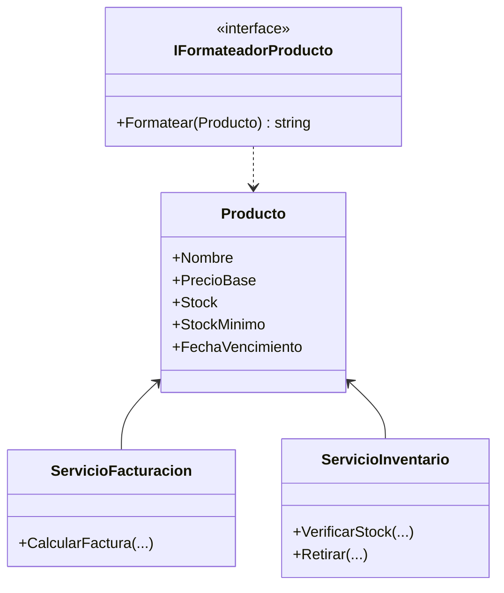
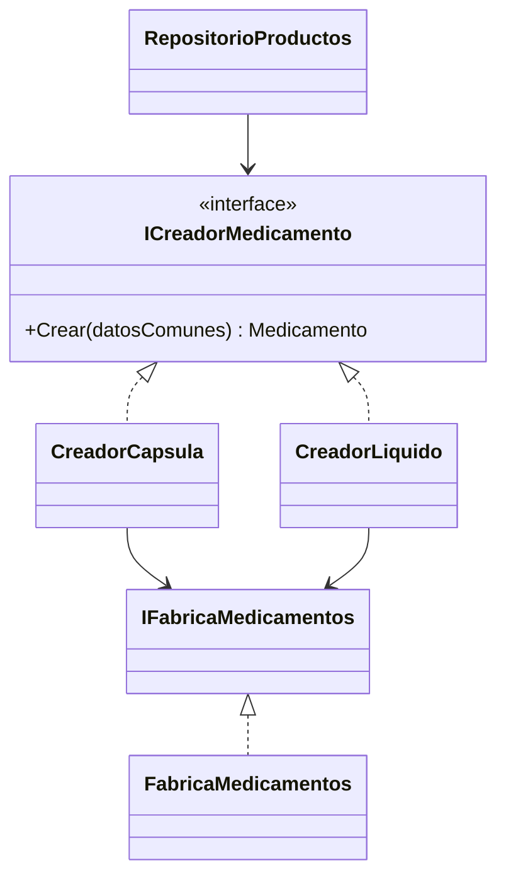
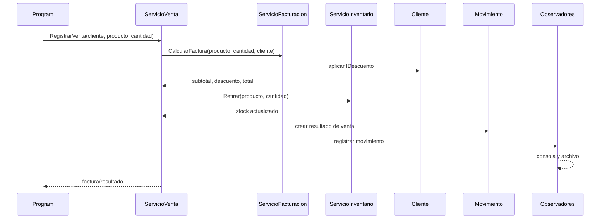
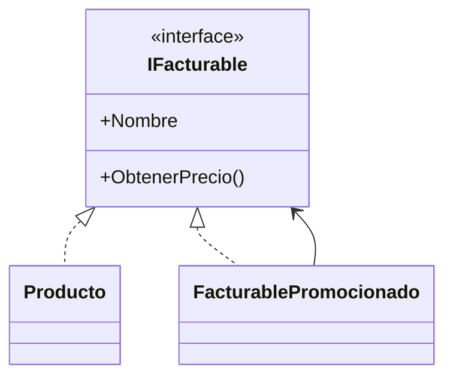

# Plan de implementacion de patrones y correccion de puntos de dolor

## Objetivo

Corregir los puntos de dolor P-01 a P-08 descritos en `Reto2-Actividad1-Puntos-de-Dolor.md`, integrar los patrones que realmente resuelven cada problema y mantener una arquitectura coherente con SOLID.

Este documento describe el trabajo futuro. **No representa una implementacion ejecutada.**

## Criterios generales

- Mantener congelados los archivos de datos existentes.
- Mantener `Program.cs` como composition root: alli se ensamblan las implementaciones concretas.
- Hacer que los servicios dependan de interfaces y no de factories, repositorios o estrategias concretas.
- Evitar una factory global que conozca medicamentos, cosmeticos y comestibles al mismo tiempo.
- No declarar Abstract Factory si el dominio no tiene familias de productos relacionadas.
- Agregar pruebas de comportamiento antes de considerar resuelto un punto de dolor.

## Estado de los patrones

| Problema | Patron objetivo | Estado actual | Estado objetivo |
|---|---|---|---|
| P-01: creacion de presentaciones de medicamentos | Factory Method para archivo y factory de medicamentos para alta interactiva | Parcial | Creacion desacoplada en ambos flujos |
| P-02: reglas de puntos | Strategy | Estructuralmente implementado | Integrado con la venta y probado |
| P-03: descuentos por cliente | Strategy | Parcial | Estrategia real por cliente y aplicada al total |
| P-04: ausencia de importe en la venta | Servicio de facturacion y objeto de resultado | Parcial | Venta calcula y conserva el importe final |
| P-05: futuras categorias de producto | Factories y servicios por categoria | No implementado | Extension sin modificar medicamentos |
| P-06: promociones sobre productos | Decorator o politica de precio | No implementado | Precio promocional temporal sin mutar el producto |
| P-07: menu monolitico | Fuera del alcance | No se interviene | Se mantiene fuera del backend |
| P-08: notificaciones desconectadas | Observer | Implementado | Mantener y probar canales multiples |

## Fase 1: corregir SRP de Producto

### Responsabilidad que debe conservar `Producto`

`Producto` debe representar el estado comun y sus invariantes:

- nombre valido;
- precio base positivo;
- stock no negativo;
- stock minimo valido;
- fecha de vencimiento valida;
- acceso al estado comun para los servicios que lo necesiten.

La entidad no debe conocer como se muestra, como se factura ni como se coordina el inventario.

### Operaciones que deben salir de `Producto`

1. **`ObtenerPrecio()`**
   - Mover su responsabilidad a `ServicioFacturacion` o a una abstraccion de precio.
   - El servicio recibira un `IFacturable` o un objeto de linea de venta y obtendra el precio base mediante un contrato de lectura.
   - La logica de precio promocional se podra decorar sin modificar `Producto`.

2. **`DescontarStock(int)`**
   - Mover la coordinacion de la salida de inventario a `ServicioInventario` o a un servicio de venta que dependa de una abstraccion de inventario.
   - Centralizar alli la validacion de cantidad, disponibilidad y eventos de stock.
   - Revisar `IInventariable` para que exponga solo el estado y las operaciones necesarias al servicio, sin obligar a `Producto` a cargar reglas de inventario que pertenezcan al servicio.

3. **`MostrarInformacion()`**
   - Mover la presentacion a un formateador, por ejemplo `IFormateadorProducto` y `FormateadorProductoConsola`, o a una operacion de consulta.
   - `Program.cs` no debera depender de metodos de presentacion definidos en la entidad.
   - El formateador podra decidir como mostrar medicamentos, servicios y futuras categorias.

### Resultado esperado

`Producto` sera una entidad de datos e invariantes. Las responsabilidades quedaran distribuidas asi:



La migracion debe hacerse sin perder las validaciones existentes. Antes de eliminar cada metodo se agregaran pruebas equivalentes en el servicio responsable.

## Fase 2: creacion de medicamentos

Se mantendran dos mecanismos porque atienden dos entradas diferentes.

### Alta interactiva

Conservar `IFabricaMedicamentos` y `FabricaMedicamentos` con sobrecargas:

```csharp
Crear(datosComunes, IRelleno relleno)
Crear(datosComunes, IEnvase envase, int mililitros)
```

Esta factory sirve cuando el administrador elige en vivo el relleno o el envase. El servicio de medicamentos dependera de la interfaz y no construira subclases concretas.

### Carga desde archivo

Usar Factory Method mediante creadores especializados:



- `RepositorioProductos` solo parseara la linea y consultara un registro de creadores.
- El repositorio no tendra un `switch` por cada medicamento.
- El repositorio no hara `new FabricaMedicamentos()` internamente.
- Los valores por defecto de relleno, envase y mililitros se configuraran en `Program.cs`.
- Los creadores delegaran la construccion concreta en `IFabricaMedicamentos` para no duplicar logica.

## Fase 3: Strategy de puntos

Conservar:

- `IReglaPuntos`;
- `ReglaPuntosEstandar`;
- `ReglaPuntosDoble`;
- inyeccion de la regla en `ServicioPuntos`.

Ajustes:

- La regla debe aplicarse al cerrar una venta, no depender solamente de una cantidad escrita manualmente.
- `ServicioPuntos` coordinara el calculo y `Cliente` conservara unicamente el estado de puntos y su validacion.
- La regla se configurara en el composition root.

Pruebas minimas:

- regla estandar: base 50 produce 50;
- regla doble: base 50 produce 100;
- cambiar la regla no requiere modificar `Cliente`, `ServicioPuntos` ni el menu.

## Fase 4: Strategy de descuentos

Conservar `IDescuento`, `SinDescuento` y `DescuentoPorcentual`.

Cambios:

- Validar el porcentaje en `DescuentoPorcentual` dentro del intervalo `[0, 1]`.
- Definir como se asigna la estrategia a cada cliente sin modificar el formato congelado de `clientes.txt`.
- La asignacion podra hacerse en el composition root mediante una configuracion por cedula, o mediante un servicio de convenios.
- `RepositorioClientes` cargara datos basicos; no debera conocer reglas de descuento concretas.
- `ServicioFacturacion` aplicara la estrategia del cliente mediante `IDescuento`.

El servicio no debera preguntar si el cliente tiene descuento porcentual, convenio u otra clase concreta.

## Fase 5: flujo de venta y facturacion

La venta debe tener un unico flujo de negocio completo:



Decisiones de diseño:

- `ServicioVenta` recibira `ServicioFacturacion` y `ServicioInventario` por abstracciones.
- La facturacion ocurrira antes de registrar el movimiento.
- La salida de inventario solo ocurrira despues de validar el total y la cantidad.
- El resultado de venta conservara subtotal, descuento, total, cliente, producto y cantidad.
- `Movimiento` o una nueva clase `Factura` debera conservar el importe calculado; la pantalla no lo recalculara retrospectivamente.
- El historial mostrara el total almacenado en el resultado de venta.
- Los puntos se calcularan a partir del importe o de la regla definida para la compra.

Esto corrige P-04 y conecta P-02 y P-03 con un flujo real.

## Fase 6: Observer de eventos

Mantener `EventoMovimiento` y el canal `IServicioNotificacion`.

Responsabilidades:

- `ServicioVenta` registra el movimiento.
- `ServicioMovimiento` dispara el evento de dominio.
- La consola se suscribe para mostrar mensajes.
- `NotificacionArchivo` se suscribe para escribir en `notificaciones.log`.
- Otros canales podran agregarse sin modificar la venta ni el evento.

Debe evitarse que `EventoMovimiento` conozca directamente a la consola o al archivo.

Pruebas minimas:

- una venta dispara una sola notificacion por suscriptor;
- la consola conserva su salida;
- el archivo recibe el mismo evento;
- quitar el canal de archivo no rompe la venta.

## Fase 7: Decorator para promociones de producto

Para P-06 se evaluara un decorador de `IFacturable`:



Reglas:

- El decorador delegara nombre y operaciones no relacionadas con precio.
- Solo modificara el precio que recibe facturacion.
- `Producto.Precio` no se mutara para aplicar una promocion temporal.
- La promocion se podra agregar o quitar sin modificar la clase producto.
- Se verificara que inventario, alertas y listado sigan usando el producto base correctamente.

Si el decorador obliga a duplicar demasiadas operaciones de inventario, se separaran los contratos de precio, inventario y catalogo en interfaces de rol mas pequenas.

## Fase 8: categorias futuras de producto

Cuando se implementen cosmeticos y comestibles, no se ampliara `IFabricaMedicamentos`.

Se crearan limites independientes:

```text
ServicioMedicamentos -> IFabricaMedicamentos
ServicioCosmeticos -> IFabricaCosmeticos
ServicioComestibles -> IFabricaComestibles
```

Una Abstract Factory solo se incorporara si aparece una familia real, por ejemplo `LineaEconomica` y `LineaPremium`, donde cada factory cree medicamentos, cosmeticos y comestibles compatibles. Sin esa dimension, factories especializadas son mas precisas y evitan una interfaz artificialmente grande.

## Matriz de aceptacion

| Punto | Evidencia requerida |
|---|---|
| P-01 | Carga de capsulas y liquidos sin switch en el repositorio; alta interactiva funcionando; pruebas de ambos creadores |
| P-02 | Dos reglas intercambiables y puntos generados desde una venta |
| P-03 | Cliente con descuento real y cliente sin descuento; total distinto y verificable |
| P-04 | `RegistrarVenta` produce y conserva subtotal, descuento y total |
| P-05 | Nueva categoria agregable sin modificar factory ni servicio de medicamentos |
| P-06 | Promocion cambia solo el precio facturado, no el precio base ni el inventario |
| P-07 | Sin cambios, por estar fuera del alcance |
| P-08 | Venta notifica a consola y archivo mediante el mismo evento |

## Checklist SOLID

- **SRP:** `Producto` conserva estado e invariantes; facturacion, inventario y presentacion viven en servicios separados.
- **OCP:** una nueva regla, canal o categoria se agrega mediante una implementacion nueva y configuracion en el composition root.
- **LSP:** todas las implementaciones de `IDescuento`, `IReglaPuntos`, `IFacturable` e `ICreadorMedicamento` respetan el contrato comun.
- **ISP:** no se crea una interfaz unica con metodos de medicamentos, cosmeticos y comestibles.
- **DIP:** repositorios y servicios reciben abstracciones; ningun repositorio instancia factories, estrategias o canales concretos.

## Orden de ejecucion

1. Agregar pruebas de caracterizacion para el comportamiento actual.
2. Separar responsabilidades de `Producto` sin cambiar resultados observables.
3. Recuperar Factory Method para la carga de medicamentos y conservar la factory de alta interactiva.
4. Integrar facturacion, descuentos, inventario y puntos en `RegistrarVenta`.
5. Persistir el resultado de venta y ajustar el historial.
6. Verificar Observer con consola y archivo.
7. Implementar Decorator para promociones.
8. Preparar factories y servicios de categorias futuras.
9. Ejecutar pruebas, compilacion y revision SOLID.
10. Documentar cualquier trade-off restante, especialmente el alcance cerrado de presentaciones de medicamentos.
